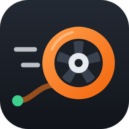
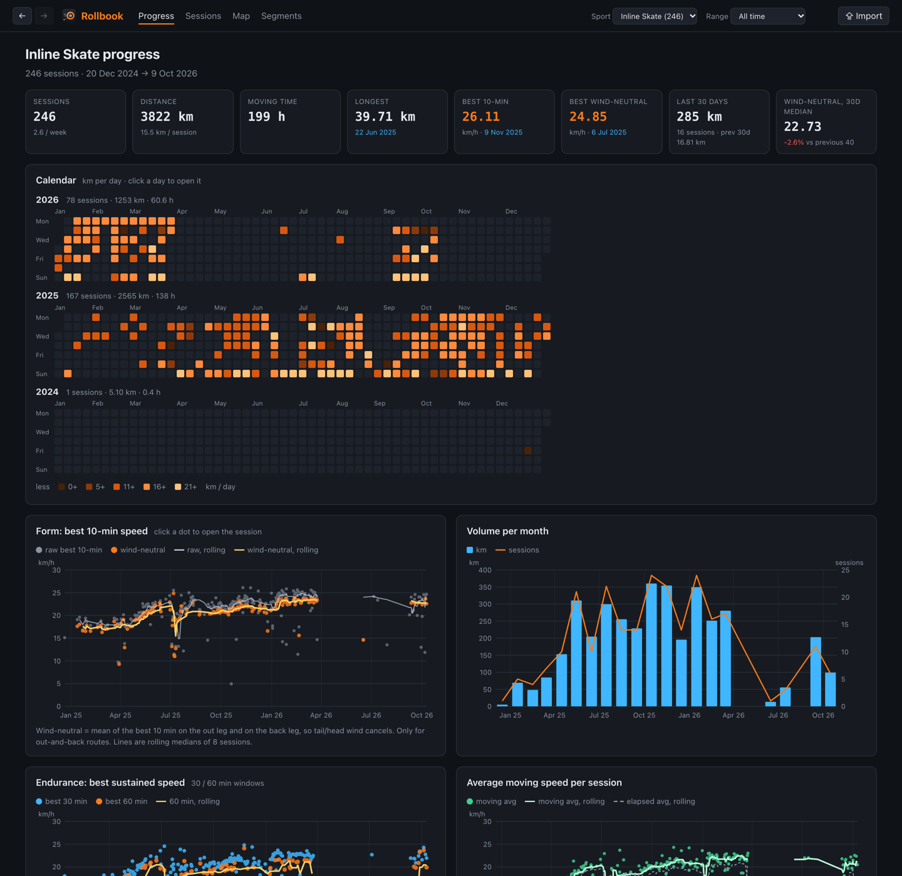
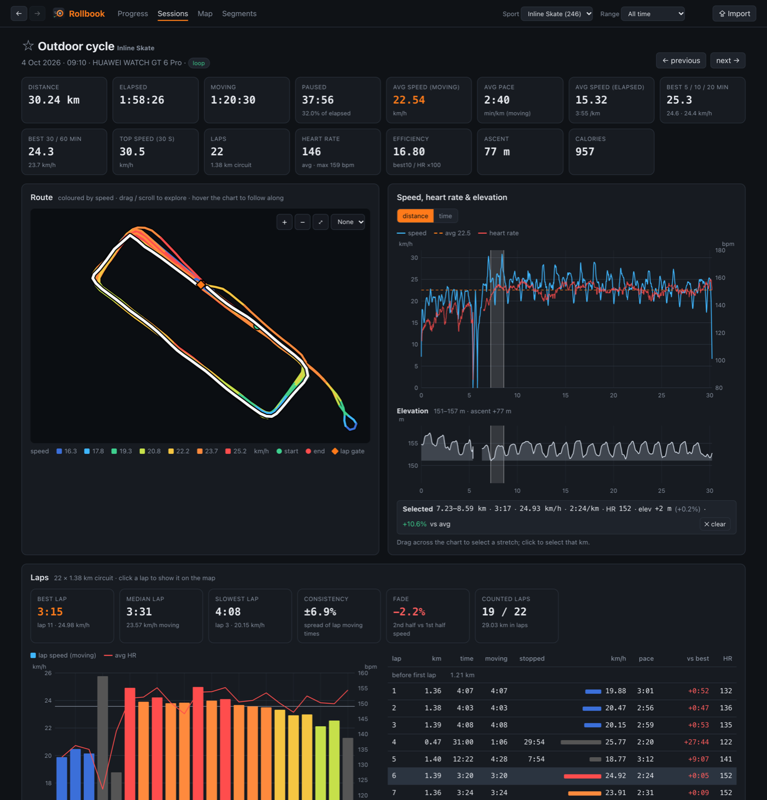
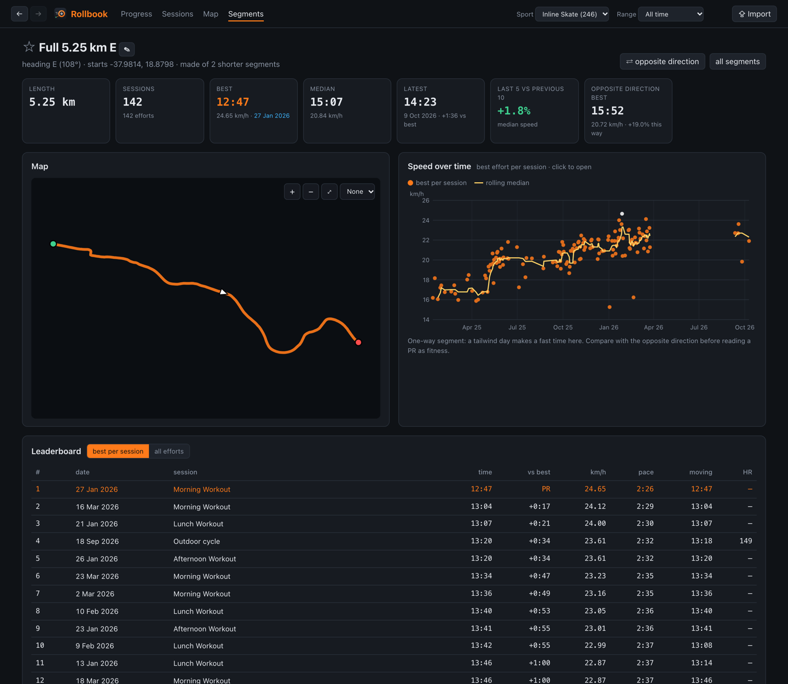
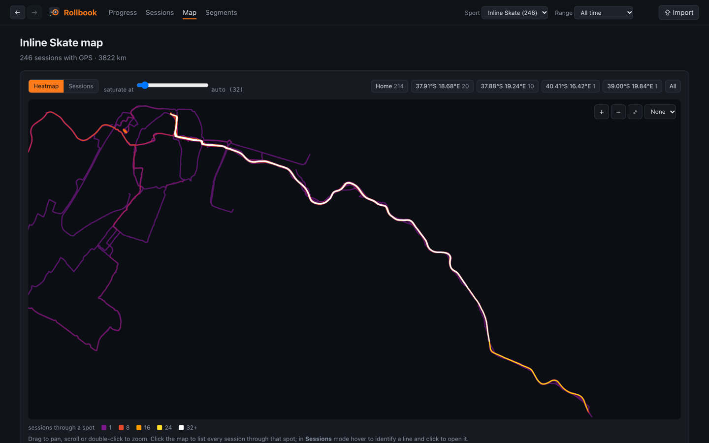

<p align="center"></p>

<h1 align="center">Rollbook</h1>

<p align="center">An offline training dashboard for your Strava data.<br>
Progress, heatmaps, laps, automatic segments with leaderboards, and wind-neutral speed. It runs on your own machine.</p>

<p align="center"></p>

## Why

Strava's API and its deeper analysis features are subscription-only. The
account export, which you can request under GDPR, is free and contains every
activity file you ever recorded. Rollbook imports that export into a local
SQLite database and gives you a dashboard on top of it. Nothing is uploaded
anywhere.

It started as a way to track inline-skating progress honestly. On an
out-and-back route a tailwind makes one leg 10–25% faster, so raw "best
10 minutes" mostly measures the weather. Rollbook splits each session at its
turnaround and reports a **wind-neutral** speed. It works for any sport with
GPS: runs, rides, walks, skates, plus indoor rides from ROUVY or MyWhoosh.

## Features

- **Progress:** calendar heatmap, volume per month, form (best 10-min and
  wind-neutral speed), endurance (best 30/60-min), efficiency (speed ÷ heart
  rate), time in heart-rate zones, personal records and a monthly summary.
- **Sessions:** a sortable list with time, pace, best efforts, laps and heart
  rate. Each session has a page with:
  - a route map coloured by speed
  - speed, heart-rate and elevation charts that follow each other on hover
  - splits per km
  - out/back legs
  - automatic **lap detection**: the best lap, consistency and fade across
    laps
  - the segments you rode
  - other sessions on the same route

  Click a km, leg or lap, or drag across a chart, to highlight that stretch
  everywhere at once.
- **Map:** a heatmap of everywhere you've been, or one line per session
  coloured by speed, distance or date. Click a spot to list every session that
  passed through it.
- **Segments:** generated automatically from the roads and loops you use most,
  each direction separately (so wind shows up), and named after the streets
  and areas they cross using OpenStreetMap. Each segment has a leaderboard and
  a speed trend, and links to the opposite direction.
- **Race predictor**, **favorites (☆)** for sessions and segments, and
  back/forward navigation.
- **Import** from the UI: drop in a full Strava export `.zip` or single
  `.fit/.gpx/.tcx` files ("Export Original"). Duplicates are detected.
- **Desktop window** (`rollbook app`) or a normal browser tab
  (`rollbook web`).

<table>
<tr><td></td>
<td></td></tr>
<tr><td align="center"><sub>A session: speed-coloured route, linked charts, laps</sub></td>
<td align="center"><sub>A segment: speed over time and its leaderboard</sub></td></tr>
</table>

<p align="center"><br>
<sub>Heatmap. The screenshots use demo data with relocated GPS and no basemap. Normally you see OpenStreetMap underneath.</sub></p>

## Requirements

- **Python 3.9 or newer.** Rollbook itself uses only the standard library, so
  nothing else is needed for `rollbook web`.
- **Optional, for a native app window:**
  [pywebview](https://pywebview.flowrl.com/). If it isn't installed,
  `rollbook app` opens Chrome, Edge, Chromium or Brave in app mode instead.
- **A Strava account export:** Strava → Settings → My Account → *Download or
  Delete Your Account* → *Request your archive*. The email with the `.zip`
  usually arrives within a few hours.

## Install

### macOS

```sh
git clone https://github.com/pjayala/rollbook.git
cd rollbook
python3 --version                       # 3.9+; if missing: brew install python
# optional native window:
python3 -m venv .venv && .venv/bin/pip install pywebview
./rollbook app
```

### Linux

```sh
git clone https://github.com/pjayala/rollbook.git
cd rollbook
python3 --version                       # 3.9+ (Debian/Ubuntu: sudo apt install python3 python3-venv)
# optional native window, needs Qt or GTK bindings:
python3 -m venv .venv && .venv/bin/pip install "pywebview[qt]"
./rollbook app
```

Without pywebview, `./rollbook app` uses an installed Chrome, Chromium, Edge
or Brave. If none is found it opens a normal browser tab.

### Windows

Install Python 3 from [python.org](https://www.python.org/downloads/) or the
Microsoft Store, then in PowerShell or cmd:

```bat
git clone https://github.com/pjayala/rollbook.git
cd rollbook
rem optional native window (uses Edge WebView2, built into Windows 10/11):
python -m venv .venv
.venv\Scripts\pip install pywebview
rollbook.cmd app
```

Without pywebview, `rollbook.cmd app` uses Edge in app mode, which comes with
Windows. No download is needed.

## First run

1. Start Rollbook: `./rollbook app` (Windows: `rollbook.cmd app`), or
   `./rollbook web` for a browser tab at <http://127.0.0.1:8765/>.
2. Click **⇪ Import** (or drag files onto the window) and drop your
   `export_….zip`. A few thousand activities import in about a minute.
   Rollbook then computes its metrics in the background, which takes about
   another minute the first time.
3. Pick a sport at the top and explore.

The same from the command line:

```sh
./rollbook db build ~/Downloads/export_12345678.zip
./rollbook db enrich --missing
./rollbook web
```

Adding sessions later: import a newer export (only new activities are added),
or a single activity's **⋯ → Export Original** file. Pick the sport in the
dialog, because watches often mislabel it; HUAWEI saves skating as
"cycling".

## Command line

| command | what it does |
|---|---|
| `rollbook app [--mode auto\|webview\|chrome\|browser]` | dashboard in its own window; the server stops when the window closes |
| `rollbook web [--port 8765] [--offline]` | dashboard on `127.0.0.1` |
| `rollbook db build <export.zip\|dir> [--fresh]` | import an export (incremental) |
| `rollbook db enrich [--missing]` | best 5/10/20-min efforts |
| `rollbook db query "SQL" [--csv]` | read-only SQL against your data |
| `rollbook analyze <file>` | one activity: pauses, splits, out/back legs, grade |
| `rollbook compare <a> <b> …` | side-by-side summary |

Use `./rollbook` on macOS/Linux and `rollbook.cmd` on Windows. All state lives
in `./data`, which is git-ignored.

## Privacy

- Your activities, the database and caches stay in `./data` on your machine.
  The server listens on `127.0.0.1` only.
- Two things go over the network, both cached forever:
  - **map tiles** from OpenStreetMap
  - **reverse geocoding** of segment points (OpenStreetMap Nominatim, at most
    one request per second) to name segments

  These requests reveal to OpenStreetMap the area you're looking at. Start
  with `--offline` to use only what's cached.
- No accounts, no telemetry, no Strava API.

## How it works

`AGENTS.md` has the detailed notes: the database schema, which speed metric
to trust for what, how laps, segments and wind-neutral speed are computed,
and a list of data-quality traps in real-world GPX/TCX/FIT files that the
importer handles. Examples include big-endian FIT files, GPS lost under a
bridge, filler altitude readings and stuck odometers.

## License

[GPL-3.0-or-later](LICENSE). Map data © OpenStreetMap contributors (ODbL).
Rollbook is not affiliated with Strava.
